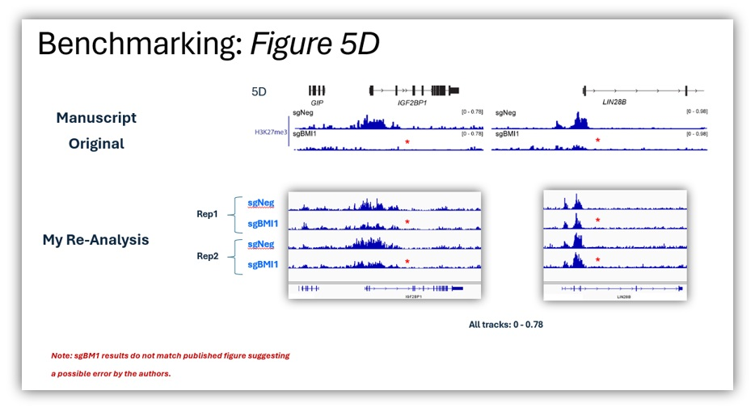
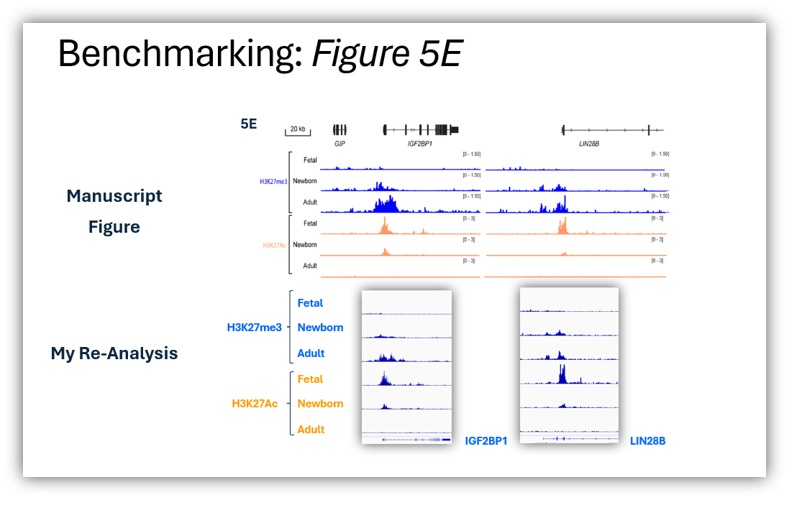
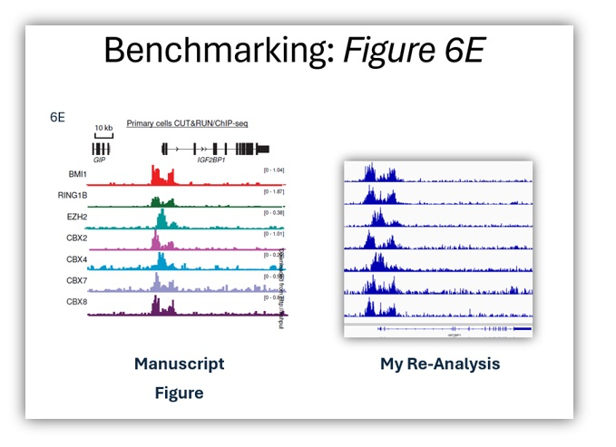

# Professional Coding Project - Example #2

- <i>Because most of the code I've written remains proprietary, I created this page to showcase my experience indirectly via the output data visualizations. 
- <i>Presented here: Data visualizations from my Cut-and-Run Seq pipeline</i> 
- <i>Additional Proprietary Pipeline Demo: [Flow Cytometry Analysis](https://github.com/The1stMartian/Pipeline-Examples)</i>

## Project Overview: Cut-and-Run Seq 
- This pipeline was developed to re-capitulate the cut-and-run experimental analysis by Qin et al. [PMID:36893455](https://pubmed.ncbi.nlm.nih.gov/36893455/)
- As the original analysis files (.bam and peak files) were not available from the authors, the analysis had to be repeated
- Unfortunately, the authors' pipeline had issues with version control, so in the end I had to rebuild it from scratch using similar/equivalent methods. 

## Technical Overview:
- An NGS analysis script written in R, utilizing various command-line bioinformatics tools
- Function: analyze NGS cut-and-run sequencing data (simlar to ChIP-Seq)
- Scope: Fastq QC, mapping, peak detection, and differential binding analysis
- Outputs: multiple tables (including differential binding analysis) and visualization files 

## Processing Steps:
- Ingests metadata with filepaths and sample groups
- Determine if reads are SE or PE
- Run QC on fastq files - FastQC
- Trim fastq files on quality and adapters - Timmomatic
- Post-trim QC - FastQC
- Map to the human genome - Bowtie2
- Align spike-in control - Bowtie2
- Sort .bam files and filter unmapped reads - SamTools
- Shift reads to account for MN'ase activity in Cut-And-Run - DeepTools ATAC Shift
- Remove PCR and optical duplicates - Picard
- Quantify mapped reads - SamTools  
- Peak Calling (narrow/broad) - MACS3
- Compare peaks between replicates - Irreproducible Discovery Rate
- Annotate Peaks - ChipSeekR
- Write non-normalized BigWig files for visualization - 
- Write spike-in control-normalized BigWig files - DeepTools bamCoverage
- Write input and spike-in control-normalized BigWig files - DeepTools bamCoverage
- Output readcounts for differential binding
- Downstream: Use readcounts as input for diffBind to quantify differential binding
- Quantification:
	- Pearson correlation test between ChIP and control samples
	- Pearson correlation test between rerun and original samples 
	- False discovery rate calculation 
	- Comparison of differentially bound regions between original and rerun

## Improvements:
- The Cut-and-Run pipeline published by the original authors did not use a docker container, making executiton problematic. I rebuilt the pipeline with the same/equivalent processing steps and using Docker for reproduciblity. I also built an OmicSoft P-script allowing it to be run vis the OmicSoft GUI.

## Quality Control/Verifiction Method:
<i>As quantitative data (peak location and abundance values) were not made available by the authors, qualitative measures were required to establish reproducibility. In essence, I remade their figures and observed almost exactly the same results, suggesting my pipeline works properly and that their original analysis was pretty accurate (with a few possible exceptions).</i>

### Figure 5D
- The abundance of histone proteins at peak region 1 in the presence/absence of the BMI1 protein shown to affect histone binding in the manuscript.
- Data from my repeat analysis are shown in the lower part of the figure and indicate a similar binding pattern to the published data. 
- Red stars indicate two disparities between the re-run and originally published results. Given the other quality control checks and overall similarity between the original and rerun data, I concluded that these point may represent errors in the authors' analysis. 

### Figure 5E
- Binding of H3K27me3 and H3K27Ac at region 2 shows differential binding in cells at three different ages (fetal, newborn, and adult) in both the original and rerun. 
- My re-analysis (lower two panels) confirms the age-dependent effect at genes IGF2BP1 and LIN28B seen in the original manuscript (upper).
- (Minor differences in the signal of H3K27me are due to minor changes in magnification in the manuscript)

### Figure 6E
- Binding pattern of multiple polycomb repressive complex proteins to the IGF2BP1 target gene
- Peak binding is consistent between the original and rerun for ach protein 

## Conclusions
- While it would be preferable to run a quantitative comparison between the original and re-run data using a Pearson correlation calculation, qualitative analyses were the only option available.
- Reproducibility between sample replicates was clearly defined using IDR, suggesting internal consistency.
- Qualitatively, peak location and general profiles appeared to match the original data, strongly suggesting that my pipeline functions properly. 
- Small disparities between my figures and the author's figure 5D raise the possibilty that there may be minor errors in the manuscript.